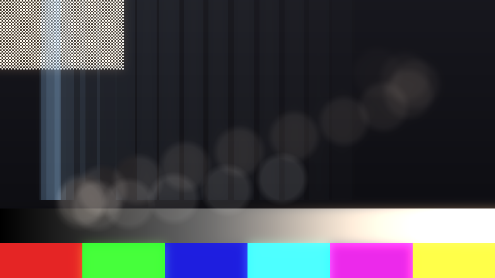
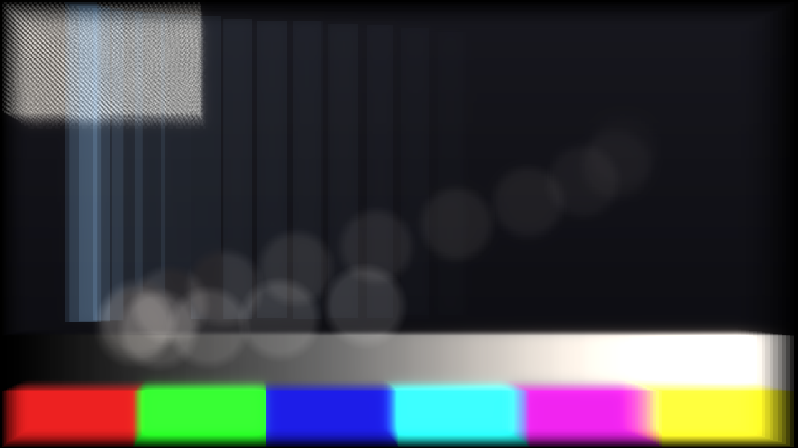

# Afterglow

> **AI-assisted project.** This codebase was created with [Claude](https://claude.com/claude-code)
> (Anthropic), directed and reviewed by a human author. The decay model is
> verified numerically by an offline harness that drives the real plugin class in
> a headless GL context: it runs the shipped GLSL against an independent C++
> implementation of the same maths — **365,696 comparisons with zero
> disagreements** — and separately proves that footage which is not moving comes
> out of the effect byte-for-byte identical to what went in (see
> [Status](#status)). Both the macOS universal bundle and the Windows x64 DLL
> build in CI. It has **never been loaded into Resolume or Resolve** — only
> compiled, rendered and measured offline. Check it in your own rig before
> trusting it in a show.

Keeps the last few dozen frames and lays them back over the picture, each one
further gone than the one in front of it — as an FFGL effect for
[Resolume](https://resolume.com) Arena and Avenue, and an OpenFX plugin for
DaVinci Resolve, Vegas, Nuke and Natron.

Not a blur and not a feedback loop. A **queue**: every frame goes in, the whole
queue comes back out over the picture, and each frame in it is dimmer, coarser,
more crushed, further drifted and further round the colour wheel than the one
in front of it — until it reaches the end and drops off.



*The harness's own moving test card, not footage. Note what has **not** happened:
the colour bars, the ramp and the checkerboard are not moving, so they come out
of the effect exactly as they went in.*

## What it does

**The trail.** Frames sets how many pictures are in the queue, from 4 to 32.
Hold sets how many host frames each one covers, so a dozen ghosts can span two
seconds. Decay shapes how the weight falls away along the trail: low and it
hangs on and drops late, high and only the last few frames read at all. Blend
decides how they combine — a weighted average, added, screened, or the
brightest of them.

**The decay.** This is the part that is not just an echo. Every control below
describes what has happened to a frame by the time it reaches the *end* of the
queue, and each frame gets that much of it in proportion to its own age:

- **Crush** — the bit depth collapsing, 8 bits down to 1.
- **Pixelate** — the grid coarsening, down to six cells across the frame.
- **Warp** — a boiling noise field pulling the picture apart, with its own
  scale and speed.
- **Drift**, **Direction**, **Zoom**, **Spin** — where the ghost has travelled
  to, and what it has done on the way.
- **Hue Shift** — how far round the wheel the colour has gone. Half a turn is
  the complement, which is where the trail stops reading as the same picture
  and starts reading as a second one.
- **Bleach** — the saturation draining out.

**Halation.** Highlights spilling off the ghosts, warm by default because that
is the colour a real halation ring is — red light scattering back off the film
base, with the emulsion having stopped the blue first. It is weighted to peak
in the *middle* of the queue: the newest frame has not aged into anything yet,
and the oldest is not there any more.



*The same card with **Background → Ghosts**, which leaves the live frame out of
the queue: what is left is the decay on its own, which is how it is meant to be
set. Crush, Pixelate, Drift and Zoom are all up.*

**Eight factory presets**: Clean Echo, Slow Burn, Datamosh, Undertow, Spin
Cycle, Bad Tape, Phosphor, Ghost Print.

## The one thing worth knowing

**A picture that is not moving comes out untouched.** Twelve copies of the same
frame average to that frame, exactly, whatever the queue length or the falloff
curve is — so the effect can be left switched on across a whole show and only
does something when something moves. That is not a happy accident; it is what
the per-slot weights are constructed to guarantee, and `agtest --still` fails
the build if it stops being true.

Screen is the deliberate exception. It lifts wherever the ghosts genuinely
differ, which is the reason to choose it, and it is checked for never
*darkening*.

## Why a queue and not a feedback buffer

The obvious way to build this is recursive: keep one buffer, blend each new
frame into it, show the result. One texture instead of thirty-two, and it makes
a genuinely similar trail — an exponential falloff is exactly what a recursive
blend produces.

It cannot make an old frame look *older*. Fold the frames together and every
degradation compounds on the accumulator instead of on the frame it belongs to:
yesterday's crush gets crushed again today, the drift integrates into a smear,
and there is no way back to the picture. Keeping the frames separately costs
memory and buys the thing the effect is actually for.

## Install

**Resolume (FFGL).** Drop `Afterglow.bundle` (macOS) or `Afterglow.dll`
(Windows) into Resolume's extra effects folder and restart:

```
macOS    ~/Documents/Resolume Arena/Extra Effects/
         ~/Documents/Resolume Avenue/Extra Effects/
Windows  %USERPROFILE%\Documents\Resolume Arena\Extra Effects\
```

**Resolve, Vegas, Nuke, Natron (OpenFX).** Copy `Afterglow.ofx.bundle` into the
standard OpenFX folder and restart the host:

```
macOS    /Library/OFX/Plugins/
Windows  C:\Program Files\Common Files\OFX\Plugins\
```

The two builds share their controls, their conversions and their whole decay
model, so a look set up in one reads the same in the other. They differ in
exactly one place, and it is documented in [AGENTS.md](AGENTS.md): the FFGL
build *remembers* the last N frames, because that is all FFGL offers, while the
OpenFX build *fetches* frame `t − k` from the clip. The OpenFX side is
therefore exact and deterministic where the FFGL side is merely faithful.

## Build

```bash
git clone --recursive https://github.com/stoatworks-labs/afterglow
cd afterglow
cmake -B build -DCMAKE_BUILD_TYPE=Release
cmake --build build
cmake --install build     # straight into Resolume's plugin folder, on macOS
```

macOS builds universal (arm64 + x86_64) by default. Add
`-DCMAKE_OSX_ARCHITECTURES=arm64` for a faster development build, and
`-DBUILD_OFX=OFF` to skip the OpenFX target.

A bundle you build yourself is unsigned, which is fine locally — quarantine only
applies to files that arrive from a browser.

## Memory

The queue is the memory cost, and it is the one number worth knowing before a
big show. Frames × the picture × 4 bytes, divided by the square of the
Resolution divisor:

| | 1080p | 1440p | 4K |
| --- | --- | --- | --- |
| 12 frames, Full | 100 MB | 177 MB | 398 MB |
| 32 frames, Full | 265 MB | 472 MB | 1061 MB |
| 32 frames, Half | 66 MB | 118 MB | 265 MB |
| 32 frames, Quarter | 17 MB | 30 MB | 66 MB |

Resolution defaults to **Full**, because the ghosts are most of what you see on
a static shot and a reduced queue softens it. The live frame is always read at
full resolution whatever Resolution says, so dropping it costs sharpness in the
trail and nowhere else.

## Status

Verified by measurement on an M4 Max, macOS 26.4:

| Check | Result |
| --- | --- |
| A still picture is not touched | Blend, Add and Lighten: **0/255 deviation**. Screen: never darker. |
| GLSL decay vs C++ decay | 15 cases × 4 aspect ratios × 2 noise scales × 2 phases × 127 points — **365,696 comparisons, 0 disagreements** |
| No dead controls | all **23** parameters measurably change the picture |
| Factory presets | all 8, against all 3 host behaviours, in both builds |
| Browser demo | its GLSL is this repo's, character for character; its ported maths agrees to 1.8e-7 |
| macOS binary | universal (`x86_64 arm64`), exports `plugMain` |
| Windows x64 | builds green in CI, plus the OpenFX bundle and the NSIS installer |
| OpenFX bundle | loads and renders through `ofxprobe`, exports `_OfxGetPlugin`, ad-hoc signs |
| Render cost | 0.66 ms/frame at 1080p, 2.6 ms at 4K with the defaults; 1.5 ms and 5.9 ms with 32 frames at Full |

Run it yourself with `tools/verify.sh`.

**Not yet done:** never loaded into Resolume, never loaded into Resolve, never
built on Linux, and the browser demo has never been watched running — only
proved to be running this repo's shaders and maths. See [AGENTS.md](AGENTS.md)
for the full list of what is assumed rather than measured, and for the traps.

<!-- attributions:start -->
This project is built on other people's work — see [ATTRIBUTIONS.md](ATTRIBUTIONS.md).
<!-- attributions:end -->
